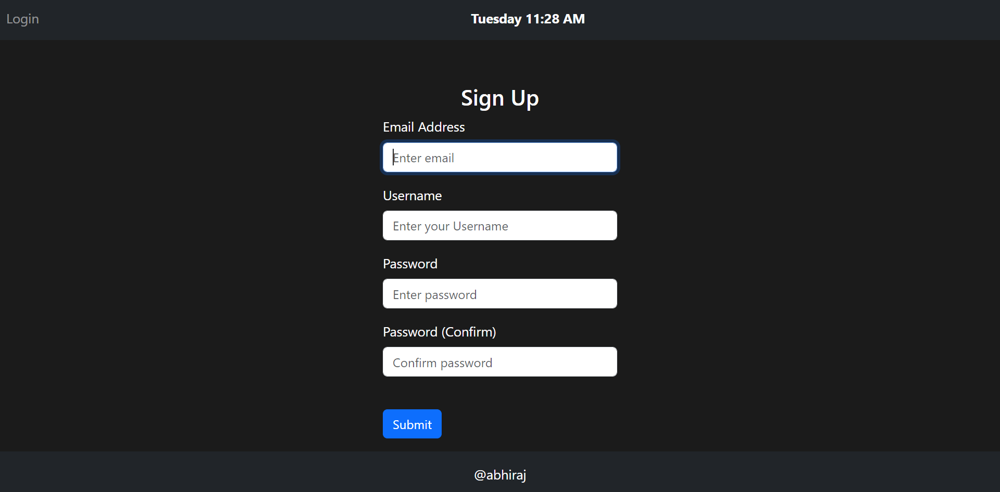

# You can login as a user.
# You can create a account as a user which means you can sign up.
# Can log out as a user.
# The current date and time is displayed on the navbar.
# Once the user logs in the user then can write notes and upload them to the database.
# After logging in then the user can write notes and upload to the database.
# The user has two modes. One mode in which a single note is made per day and the 
# other mode is where he can write multiple nodes in a day.
# The state of the modes of the app is saved in the database.
# So the user state is saved when the user toggles the button.
# Along with the note data the day and date and year is also saved in the database.
# While uploading the data, cards are saved along the date and day when the upload is clicked.
# The note data is then passed through the NLTK Ml library, which gives the sentiment of the note data. The sentiment is shown using multicolor bordered color.
# The sentiment is then stored in the database. The data base stores the sentiment which is also stored.
# The sentiments are shown via different colour shades. The red colour shade shows some negative sentiment and green colour shows positive sentiment. The yellow colour shows neutral sentiment.
# The sentiments are also saved in the database.
# All the data is saved using sqlite in the database.
# Apart from this the user can search for his daily journal or notes directly from the database using the search button. When the user clicks the button search button along with date of input, the search in the database is made and all the notes on the approprite date is shown. 
# There is a delete button which helps the user to delete his account. Password and the user email is verified before the deletion process is proceeded.
